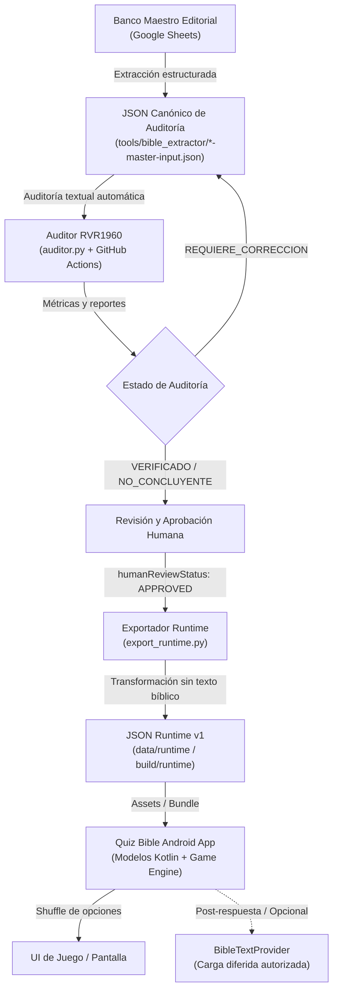

# Arquitectura de Banco de Preguntas y Contrato Runtime — Quiz Bible

---

## 1. Visión General de la Arquitectura

Quiz Bible implementa una separación estricta y unidireccional entre la capa editorial/metodológica, la capa de auditoría canónica y la capa de entrega en tiempo de ejecución (Runtime/App). Esta arquitectura garantiza que:
1. El banco maestro y los bancos canónicos no requieran adaptaciones artificiales ni degradación estructural para ajustarse a las necesidades de interfaz de usuario.
2. El formato de runtime consumible por la aplicación Android sea ligero, determinista, tipado y desprovisto de texto bíblico persistido.
3. La auditoría textual contra fuentes formales (RVR1960 vía ApiBiblia) opere como un filtro de calidad previo e independiente de la aprobación humana y del motor de juego.



---

## 2. Las Tres Capas de Datos

### Capa A: Banco Maestro Editorial (Google Sheet)
- **Propósito**: Fuente original de redacción, curaduría teológica, control de metadatos, categorización y trazabilidad por autores.
- **Estructura**: Columnas tabulares con clave fija `opcion_a` como respuesta canónicamente correcta.
- **Principio**: No se modifica por requerimientos de visualización o frameworks de desarrollo móvil.

### Capa B: JSON Canónico de Auditoría (`tools/bible_extractor/*-master-input.json`)
- **Propósito**: Unidad de versión, cálculo de SHA-256 inmutable, trazabilidad de libros y entrada para la suite de auditoría textual contra ApiBiblia.
- **Estructura**:
  - `id`: Formato `NQB-AT-[LIBRO]-[0001-9999]`.
  - `book`, `chapter`, `verse_start`, `verse_end`, `reference`.
  - `category`, `subcategory`, `characters`.
  - `difficulty`: `"Básico"`, `"Intermedio"`, `"Avanzado"`, `"Experto"`.
  - `question_type`: `"Selección múltiple"`.
  - `question`, `opcion_a`, `opcion_b`, `opcion_c`, `opcion_d`, `correct_option`: `"A"`, `correct_answer`.
  - `explanation`.
  - `eligible_modes`: `["AT", "AMBOS", "PERSONAJES_AT", ...]`.
  - `additional_references`: `[]`.

### Capa C: JSON Runtime (`quiz_bible_runtime_v1.json`)
- **Propósito**: Formato optimizado, determinista y tipado para consumo directo en la aplicación Android.
- **Estructura**: Definida por el schema `data/runtime/quiz_bible_runtime_v1.schema.json`.
- **Principio**: Generado de forma automatizada mediante `export_runtime.py`. De solo lectura, sin persistir versículos bíblicos.

---

## 3. Principios y Distinciones Críticas

### A. `CANONICAL != RUNTIME`
El JSON canónico almacena campos con la nomenclatura y estructura de auditoría (`verse_start`, `opcion_a`, `difficulty` en español, etc.). El JSON runtime utiliza camelCase estándar (`verseStart`, `referenceDisplay`, `options`, enums técnicos en mayúsculas como `BASIC`, `INTERMEDIATE`).

### B. `AUDITED != HUMAN_APPROVED`
- `auditStatus`: Resultado de la auditoría objetiva contra el texto RVR1960 (`VERIFIED`, `INCONCLUSIVE`, `REQUIRES_CORRECTION`).
- `humanReviewStatus`: Estado editorial y de gobernanza (`PENDING`, `APPROVED`, `REJECTED`).
- **Regla de Producción**: Una pregunta solo puede entrar al mazo de producción de la app cuando:
  $$\text{auditStatus} \neq \text{REQUIRES\_CORRECTION} \quad \land \quad \text{humanReviewStatus} == \text{APPROVED}$$

### C. `CORRECT_OPTION_A_CANONICAL != VISUAL_POSITION`
En los bancos canónicos y en el archivo runtime, la opción correcta siempre posee `id = "A"` y `correctOptionId = "A"`.
La **randomización (shuffle)** es responsabilidad exclusiva del motor de juego de Android al momento de instanciar la ronda. La aplicación asocia la respuesta seleccionada por el usuario mediante el identificador del objeto (`RuntimeOption.id == "A"`), independientemente de que visualmente aparezca en la primera, segunda, tercera o cuarta posición.

### D. No Persistencia de Fuentes Bíblicas
El runtime JSON **NO** contiene campos de texto bíblico (`verseText`, `texto_biblico`, `passage`, etc.).
El metadato `verificationTranslation: "RVR1960"` indica la versión utilizada para certificar la respuesta, pero el versículo se recupera de manera diferida bajo demanda después de que el usuario responde.

---

## 4. Contrato de Datos Kotlin Propuesto para Android

```kotlin
package com.example.quizbible.domain.model

enum class Testament {
    OT, NT
}

enum class Difficulty {
    BASIC, INTERMEDIATE, ADVANCED, EXPERT
}

enum class QuestionType {
    MULTIPLE_CHOICE
}

enum class AuditStatus {
    VERIFIED, INCONCLUSIVE, REQUIRES_CORRECTION
}

enum class HumanReviewStatus {
    PENDING, APPROVED, REJECTED
}

data class RuntimeOption(
    val id: String,
    val text: String
)

data class RuntimeQuestion(
    val id: String,
    val testament: Testament,
    val book: String,
    val chapter: Int,
    val verseStart: Int,
    val verseEnd: Int?,
    val referenceDisplay: String,
    val category: String,
    val subcategory: String?,
    val characters: List<String>,
    val difficulty: Difficulty,
    val questionType: QuestionType,
    val prompt: String,
    val options: List<RuntimeOption>,
    val correctOptionId: String,
    val explanation: String,
    val eligibleModes: List<String>,
    val verificationTranslation: String?,
    val auditStatus: AuditStatus,
    val humanReviewStatus: HumanReviewStatus
) {
    val isProductionReady: Boolean
        get() = auditStatus != AuditStatus.REQUIRES_CORRECTION &&
                humanReviewStatus == HumanReviewStatus.APPROVED
}

data class QuizBibleRuntimeCollection(
    val schemaVersion: String,
    val generatedAt: String,
    val totalQuestions: Int,
    val questions: List<RuntimeQuestion>
)

/**
 * Interfaz futura para recuperación de pasajes autorizados.
 * La implementación real se definirá considerando licencias, almacenamiento offline o proxy seguro.
 */
interface BibleTextProvider {
    suspend fun getPassage(
        book: String,
        chapter: Int,
        verseStart: Int,
        verseEnd: Int?
    ): String?
}
```

---

## 5. Flujo de Juego y Visualización en Android

1. **Selección de Modo y Dificultad**:
   El usuario selecciona, por ejemplo, `Modo: Antiguo Testamento` y `Dificultad: Intermedio`.
   El repositorio filtra en memoria:
   ```kotlin
   val roundQuestions = allQuestions.filter { q ->
       q.eligibleModes.contains("AT") && q.difficulty == Difficulty.INTERMEDIATE
   }
   ```
2. **Presentación de Pregunta**:
   El motor de juego toma una pregunta y baraja sus 4 opciones:
   ```kotlin
   val shuffledOptions = question.options.shuffled()
   ```
3. **Respuesta del Usuario**:
   El usuario toca una opción en pantalla ($O_i$).
   El sistema evalúa:
   ```kotlin
   val isCorrect = (selectedOption.id == question.correctOptionId)
   ```
4. **Retroalimentación Inmediata**:
   Se muestra si fue correcta o incorrecta, acompañada de `question.explanation` y `question.referenceDisplay`.
5. **Lectura Bíblica Opcional (Post-Respuesta)**:
   Si el usuario tiene activada la preferencia de ver el texto bíblico, se invoca `BibleTextProvider.getPassage(book, chapter, start, end)` para consultar y renderizar el pasaje correspondiente de forma segura y autorizada.

---

## 6. Validación Técnica del Checkpoint

Se generó la muestra de 20 preguntas en `build/runtime/quiz_bible_runtime_sample_v1.json` con las siguientes características:
- **Total de preguntas**: 20
- **Dificultades**: 6 BASIC, 6 INTERMEDIATE, 5 ADVANCED, 3 EXPERT.
- **Categorías**: 10 AT_GENERAL, 10 PERSONAJES_BIBLICOS.
- **Libros representados**: 14 libros (Génesis a 2 Crónicas).
- **Validación de Schema**: 100% PASS contra `quiz_bible_runtime_v1.schema.json`.
- **Persistencia de texto bíblico**: Cero texto persistido (`assert_no_forbidden_keys` 100% OK).
- **Pruebas unitarias**: 12/12 tests de exportación y contrato passing en `test_export_runtime.py`.
- **Determinismo**: SHA-256 reproducible idéntico en ejecuciones sucesivas (`7e091645bbfa89be6b5d3eef0bcf5d6458d93ca0acd621edd6196647aa35dae3`).

---

## 7. Conclusión

El banco maestro y los bancos canónicos estructurados actuales **alimentan de forma directa y transparente** a la arquitectura de Android a través de `export_runtime.py`, sin pérdida de metadatos, sin necesidad de reformular preguntas y preservando la integridad del contenido editorial.
