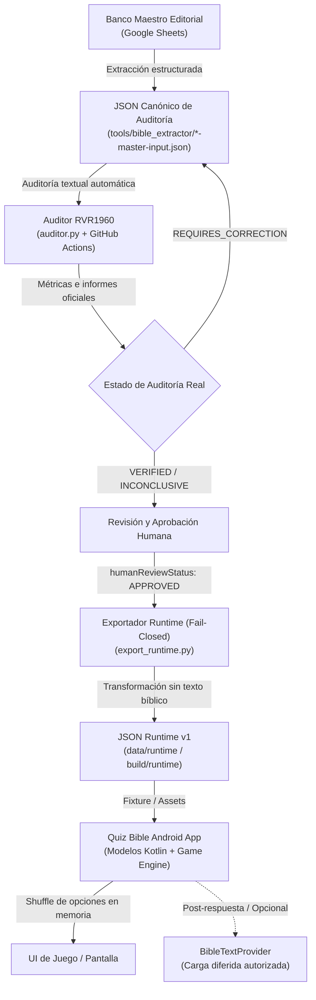

# Arquitectura de Banco de Preguntas y Contrato Runtime — Quiz Bible

---

## 1. Visión General de la Arquitectura

Quiz Bible implementa una separación estricta y unidireccional entre la capa editorial/metodológica, la capa de auditoría canónica y la capa de entrega en tiempo de ejecución (Runtime/App). Esta arquitectura garantiza que:
1. El banco maestro y los bancos canónicos no requieran adaptaciones artificiales ni degradación estructural para ajustarse a las necesidades de interfaz de usuario.
2. El formato de runtime consumible por la aplicación Android sea ligero, determinista, tipado, validado por schema y desprovisto de texto bíblico persistido.
3. La auditoría textual contra fuentes formales (RVR1960 vía ApiBiblia) opere como un filtro de calidad previo e independiente de la aprobación humana y del motor de juego, aplicando una política **Fail-Closed** incondicional.



---

## 2. Las Tres Capas de Datos

### Capa A: Banco Maestro Editorial (Google Sheet)
- **Propósito**: Fuente original de redacción, curaduría teológica, control de metadatos, categorización y trazabilidad por autores.
- **Estructura**: Columnas tabulares con clave fija `opcion_a` como respuesta canónicamente correcta.
- **Principio**: No se modifica por requerimientos de visualización o frameworks de desarrollo móvil.

### Capa B: JSON Canónico de Auditoría (`tools/bible_extractor/*-master-input.json`)
- **Propósito**: Unidad de versión, cálculo de SHA-256 inmutable, trazabilidad de libros y entrada para la suite de auditoría textual contra ApiBiblia.
- **Estructura**:
  - `id`: Formato `NQB-AT-[LIBRO]-[0001-9999]`.
  - `book`, `chapter`, `verse_start`, `verse_end`, `reference`.
  - `category`, `subcategory`, `characters`.
  - `difficulty`: `"Básico"`, `"Intermedio"`, `"Avanzado"`, `"Experto"`.
  - `question_type`: `"Selección múltiple"`.
  - `question`, `opcion_a`, `opcion_b`, `opcion_c`, `opcion_d`, `correct_option`: `"A"`, `correct_answer`.
  - `explanation`.
  - `eligible_modes`: `["AT", "AMBOS", "PERSONAJES_AT", ...]`.
  - `additional_references`: `[]`.

### Capa C: JSON Runtime (`quiz_bible_runtime_v1.json`)
- **Propósito**: Formato optimizado, determinista, tipado y validado para consumo directo en la aplicación Android.
- **Estructura**: Definida por el schema `data/runtime/quiz_bible_runtime_v1.schema.json`.
- **Principio**: Generado de forma automatizada mediante `export_runtime.py`. De solo lectura, sin persistir versículos bíblicos y con estados de auditoría estrictos.

---

## 3. Principios y Distinciones Críticas

### A. Política Fail-Closed en la Exportación
1. **`auditStatus`**: No se asigna por defecto a `VERIFIED`. El exportador requiere una fuente explícita de auditoría (`--audit-sources`, `--audit-dir` o diccionario). Si un ID no cuenta con estado registrado en el informe de auditoría, la exportación se rechaza con `ValueError`.
2. **`testament`**: Solo se aceptan IDs canónicos (`-AT-` / `-NT-`) o libros bíblicos reconocidos. Casos no reconocidos generan error de inmediato.
3. **`questionType`**: Solo se aceptan tipos canónicos soportados (`Selección múltiple` $\rightarrow$ `MULTIPLE_CHOICE`). Tipos desconocidos generan error explícito.

### B. `AUDITED != HUMAN_APPROVED`
- `auditStatus`: Resultado de la auditoría objetiva contra el texto RVR1960 (`VERIFIED`, `INCONCLUSIVE`, `REQUIRES_CORRECTION`).
- `humanReviewStatus`: Estado editorial y de gobernanza (`PENDING`, `APPROVED`, `REJECTED`).
- **Regla de Producción**: Una pregunta solo puede entrar al mazo de producción de la app cuando:
  $$\text{auditStatus} \neq \text{REQUIRES\_CORRECTION} \quad \land \quad \text{humanReviewStatus} == \text{APPROVED}$$

### C. `CORRECT_OPTION_A_CANONICAL != VISUAL_POSITION`
En los bancos canónicos y en el archivo runtime, la opción correcta siempre posee `id = "A"` y `correctOptionId = "A"`.
La **randomización (shuffle)** es responsabilidad exclusiva del motor de juego de Android al momento de instanciar la ronda. La aplicación asocia la respuesta seleccionada por el usuario mediante el identificador del objeto (`RuntimeOption.id == "A"`), independientemente de que visualmente aparezca en la primera, segunda, tercera o cuarta posición.

### D. No Persistencia de Fuentes Bíblicas
El runtime JSON **NO** contiene campos de texto bíblico (`verseText`, `texto_biblico`, `passage`, etc.).
El metadato `verificationTranslation: "RVR1960"` indica la versión utilizada para certificar la respuesta, pero el versículo se recupera de manera diferida bajo demanda después de que el usuario responde.

---

## 4. Contrato de Datos Kotlin Implementado en Android

Implementado y validado en la rama de spike `checkpoint/runtime-android-contract`:

```kotlin
package com.example.quizbible.model

enum class Testament {
    OT, NT
}

enum class Difficulty {
    BASIC, INTERMEDIATE, ADVANCED, EXPERT
}

enum class QuestionType {
    MULTIPLE_CHOICE
}

enum class AuditStatus {
    VERIFIED, INCONCLUSIVE, REQUIRES_CORRECTION
}

enum class HumanReviewStatus {
    PENDING, APPROVED, REJECTED
}

data class RuntimeOption(
    val id: String,
    val text: String
)

data class RuntimeQuestion(
    val id: String,
    val testament: Testament,
    val book: String,
    val chapter: Int,
    val verseStart: Int,
    val verseEnd: Int?,
    val referenceDisplay: String,
    val category: String,
    val subcategory: String?,
    val characters: List<String>,
    val difficulty: Difficulty,
    val questionType: QuestionType,
    val prompt: String,
    val options: List<RuntimeOption>,
    val correctOptionId: String,
    val explanation: String,
    val eligibleModes: List<String>,
    val verificationTranslation: String?,
    val auditStatus: AuditStatus,
    val humanReviewStatus: HumanReviewStatus
) {
    val isProductionReady: Boolean
        get() = auditStatus != AuditStatus.REQUIRES_CORRECTION &&
                humanReviewStatus == HumanReviewStatus.APPROVED
}

data class QuizBibleRuntimeCollection(
    val schemaVersion: String,
    val generatedAt: String,
    val totalQuestions: Int,
    val questions: List<RuntimeQuestion>
)

interface BibleTextProvider {
    suspend fun getPassage(
        book: String,
        chapter: Int,
        verseStart: Int,
        verseEnd: Int?
    ): String?
}
```

---

## 5. Validación Técnica y Ejecución de Pruebas

### A. Validación en Capa Python (`tools/runtime_export/test_export_runtime.py`)
- **Total de pruebas**: 14/14 tests passing.
- **Distribución de 2 Crónicas**: Validada sobre las 102 preguntas reales:
  - `VERIFIED = 76`
  - `INCONCLUSIVE = 26`
  - `REQUIRES_CORRECTION = 0`
- **Fail-Closed**: Verificado para `auditStatus`, `testament` y `questionType`.

### B. Validación en Capa Android (`RuntimeQuestionTest.kt` vía Gradle)
- **Rama temporal**: `checkpoint/runtime-android-contract`
- **Comando**: `.\gradlew.bat testDebugUnitTest`
- **Resultados**: 7 tests ejecutados, 0 fallos, 0 errores (100% OK).
- **Aspectos Comprobados**:
  1. Deserialización completa del JSON fixture de 20 preguntas sin pérdida de datos.
  2. Preservación de 4 opciones por pregunta y vinculación de `correctOptionId == "A"`.
  3. Deserialización tipada de dificultades (`BASIC`, `INTERMEDIATE`, `ADVANCED`, `EXPERT`).
  4. Filtrado en memoria por modos (`AT`, `PERSONAJES_AT`, `AMBOS`) y categorías.
  5. Barajado (`shuffled`) en Kotlin preservando la opción correcta en todas las posiciones visuales (0, 1, 2, 3).
  6. Evaluación de la regla de producción `isProductionReady`.

---

## 6. Conclusión Definitiva

$$\mathbf{MASTER \rightarrow RUNTIME = APROBADO}$$
$$\mathbf{RUNTIME \rightarrow ANDROID = APROBADO}$$
$$\mathbf{CHECKPOINT\ GENERAL = APROBADO}$$

El contrato de datos y la cadena de exportación están técnicamente certificados.
